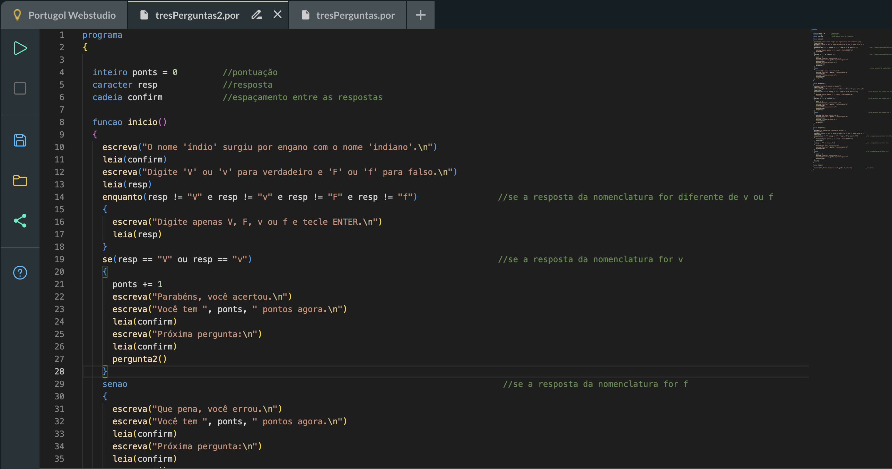

# pensamentoComputacional-2024_01

***ALL PROJECTS MADE BY*** : **Rafael Bettinelli**

## - DAYS
  - [*03/21*](2024_03_21)
    - Meeting ****Github****
  - [*04/15*](2024_04_15)
    - [*First* **Python** contact](2024_04_15/test.py)
  - [*04/16*](2024_04_16)
    - [Pythagorean Theorem](2024_04_16/pitagoras.py)
  - [*04/22*](2024_04_22)
    - [Leap Year](2024_04_22/anoBissexto.py)
    - [Contest Informations](2024_04_22/censo.py)
    - [What's your *"Programming Language"* based on your **birth**](2024_04_22/mesProgramador.py)
  - [*04/23*](2024_04_23)
    - [**Factorial** Calculation](2024_04_23/fatorial.py)
    - Printing a ***Losangle***
  - *05/25*
    - Guess the Number
  - *05/20*
    - Addres Activity
  - *05/28*
    - ***Parentheses*** Comparison
    - **Prime Numbers**
    - Sum Pairs

[notes1](2024_03_21/notes1.md)

[Portugol C em PTBR](https://portugol.dev)

| People | Age | Means | 
|:----------|:-------------:|------:| 
| Person0 | 00 | Was this Born? |
| Person1 | 12 | Young |
| Person2 | 18 | OK |
| Person3 | 68 | Elderly |
| Person4 | 126 | Is this Alive? |